# Health Trace 🩺✨

Health Trace is a modular, high-performance personal health analytics dashboard built with Flutter. It interfaces directly with native **Android Health Connect** to securely aggregate, normalize, and visualize a rolling 14-day history loop of essential fitness and biometric telemetry (Steps, Sleep cycles, and Resting Heart Rate frequencies).

The app's underlying engineering is built around a custom **single-pass hybrid processing pipeline**. Designed to address the common "Cold Start" empty state issue in health apps, Health Trace dynamically monitors user data density. It seamlessly shifts between raw hardware sensor records and context-aware mathematical simulation layers, ensuring a polished, functional, and fully interactive dashboard experience from the very first install.

---

## 🏃 App Uses & Capabilities

* **Centralized Vital Metrics Monitoring:** Provides a single, unified viewport to track active daily physical progress alongside underlying cardiac and sleep biometrics.
* **Dual-Week Comparative Timelines:** Organizes historical trends into side-by-side current-week and previous-week structural blocks for clear habit evaluation.
* **Granular Sleep Analysis:** Automatically maps raw night-time sessions into real-time metrics, parsing total resting durations and sleep status variations.
* **Instantaneous Pulse Tracking:** Captures sub-interval heart rate records from hardware sensors to reliably evaluate daily averages against real-time measurements.

---

## 🛠️ System Requirements

To build, compile, and run Health Trace locally, your environment must satisfy the following development benchmarks:

### Development Tooling
* **Flutter SDK:** Version `^3.22.0` (or modern matching stable releases)
* **Dart SDK:** Version `^3.4.0`
* **Operating System:** macOS (recommended for Android toolchain alignment) or Windows 11
* **Java Development Kit:** JDK 17 (Required by modern Gradle compiler layers)

### Hardware & Android Runtime
* **Android OS Version:** Android 11 (API Level 30) or higher.
* **Google Core API Framework:** The target hardware device must have the official **Google Health Connect** system app installed to manage secure permissions and background data-sharing hooks.

---

## 🎯 Problems & Solutions Matrix

| Real-World Pitfall | The Health Trace Solution |
| --- | --- |
| **The Cold Start Problem:** Fresh software installations show completely blank or broken charts, devastating initial user engagement. | **Context-Aware Simulation:** Dynamically injects randomized historical telemetry data loops, letting users preview the app's full analytical capabilities immediately. |
| **Silent OS Dependency Failures:** If a custom Android OS lacks the Health Connect API, typical background tasks throw fatal unhandled runtime exceptions. | **Graceful Package Interception:** Safely catches missing framework dependencies, replaces crashes with an explicit fallback screen, and links directly to the Play Store. |
| **Skewed Behavioral Habits:** Blending mock data with true tracking data corrupts the integrity of real-world fitness analysis. | **Density Gating Threshold:** Implements a strict data density rule. The exact millisecond the app verifies **3+ unique days** of real data, all simulation code shuts off permanently. |

---
## 📸 Screenshots
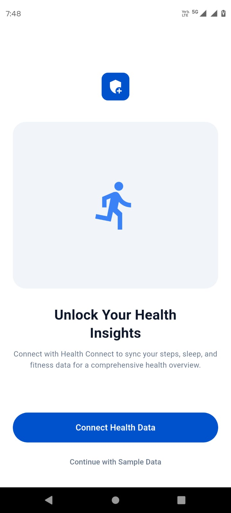 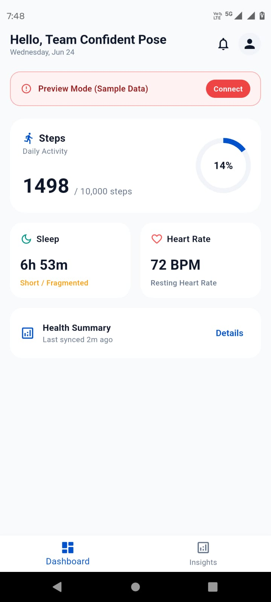
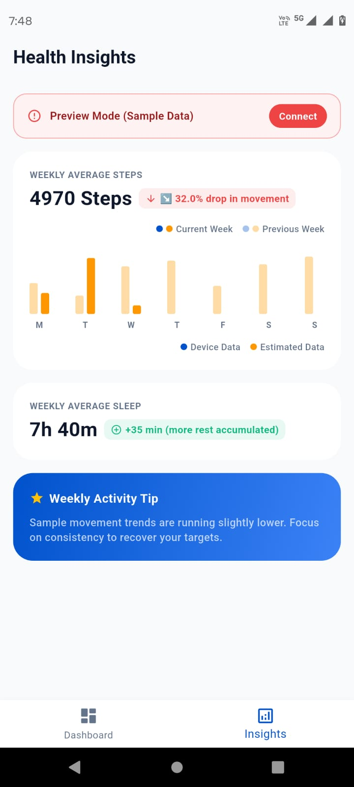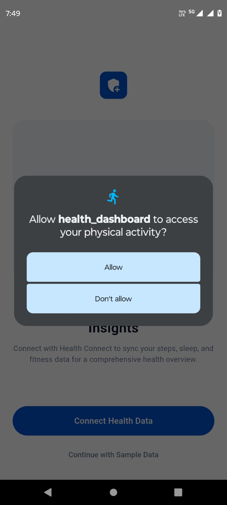
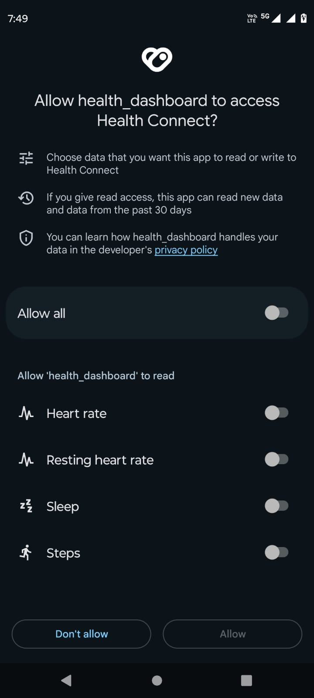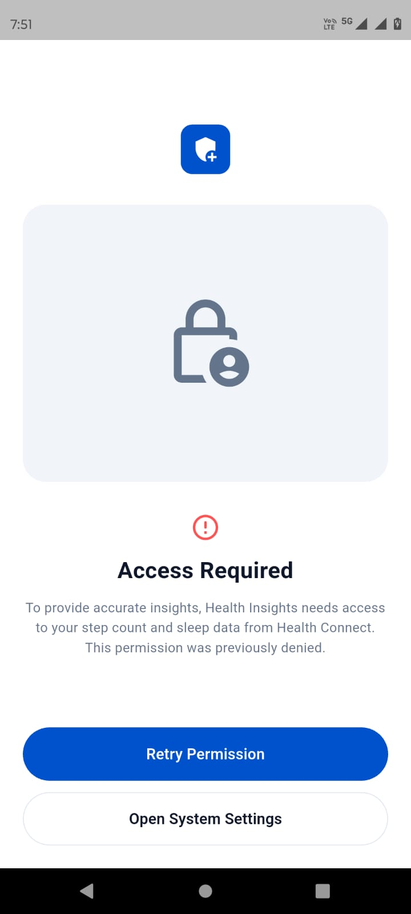
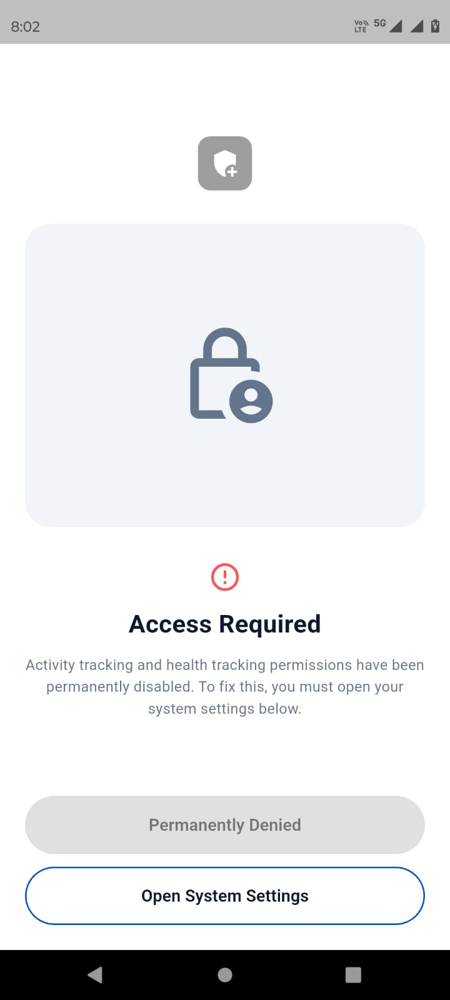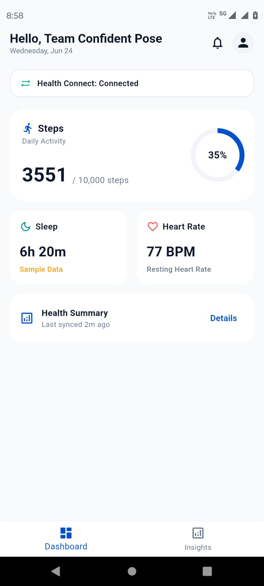
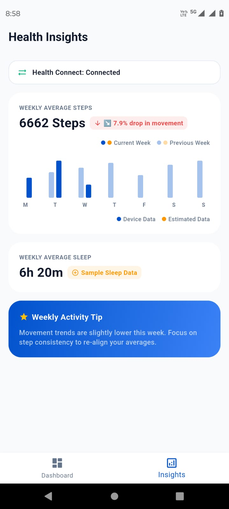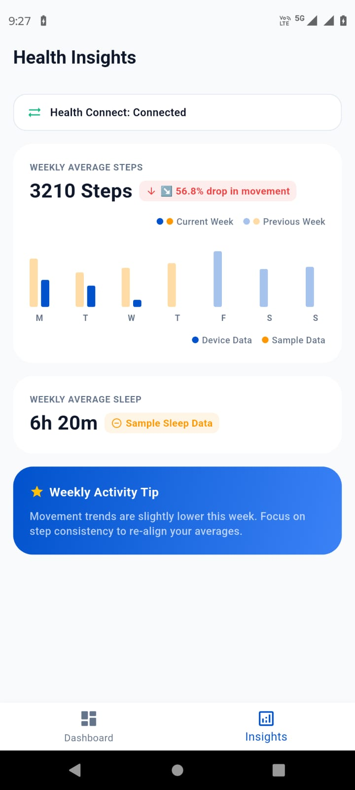
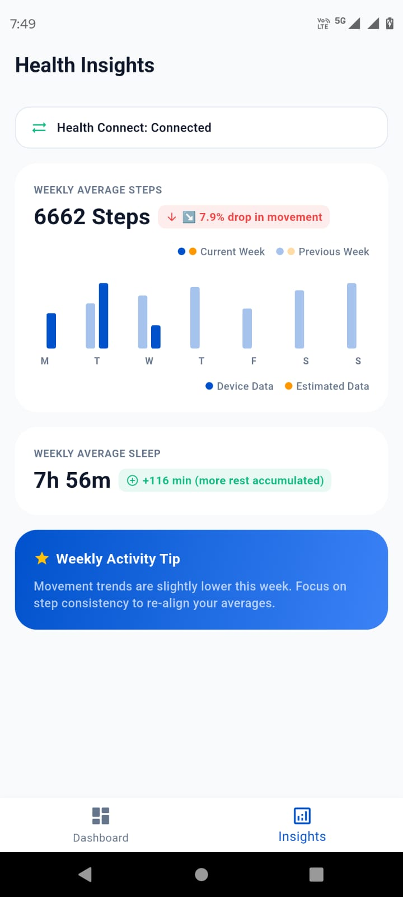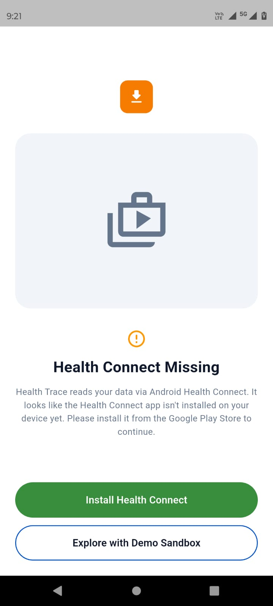


---

## 🎨 Architectural Design Choices & Engineering Decisions

### 1. The "Cold Start" Choice
* **The Unknown:** How to populate an attractive UI tracking ecosystem before the user has generated any real-world health history.
* **Decision/Assumption:** I assumed that an empty, unpopulated graph matrix hurts initial app adoption. I decided to build an automated, randomized historical backfill algorithm. To ensure total transparency, these simulated loops are isolated in Orange and clearly badged as "Sample Data".

### 2. Protecting Data Authenticity via Density Gating
* **The Unknown:** How to ensure mock data does not pollute legitimate fitness trends once the user begins actively wearing their device.
* **Workaround:** I engineered a high-performance pre-scan algorithm that tracks unique calendar timestamps using a `Set<String>` map. As soon as the user logs **3 or more unique tracking days**, the entire mock data generator is completely deactivated. Gaps are then preserved as authentic 0-value Blue segments to protect the validity of user analytics.

### 3. Asynchronous Lifecycle Interception
* **The Unknown:** Handling scenarios where a user updates or removes required system components (Health Connect APK) while the app is paused in the background.
* **Workaround:** I implemented Flutter's native `WidgetsBindingObserver` mixin to create a foreground lifecycle interceptor. If the background framework goes missing, the UI gracefully traps the exception, hides the active dashboard, and serves an explicit deep-link button using the `market://` intent protocol. The moment the user re-installs and returns to the app, the lifecycle observer hooks the foreground refresh to resume tracking with zero manual clicks.

---

## 💻 Tech Stack & Dependencies

The production architecture is kept lean, relying exclusively on heavily maintained, industry-standard packages to prevent dependency conflicts:

```yaml
dependencies:
  flutter:
    sdk: flutter

  # State Management & Architectural Bindings
  provider: ^6.1.2

  # Hardware Permission Handlers & System Intents
  permission_handler: ^11.3.1

  # Native Play Store Deep-Linking Architecture
  url_launcher: ^6.3.1

  # Native Bridges for Android Health Connect APIs
  health: ^10.0.0
